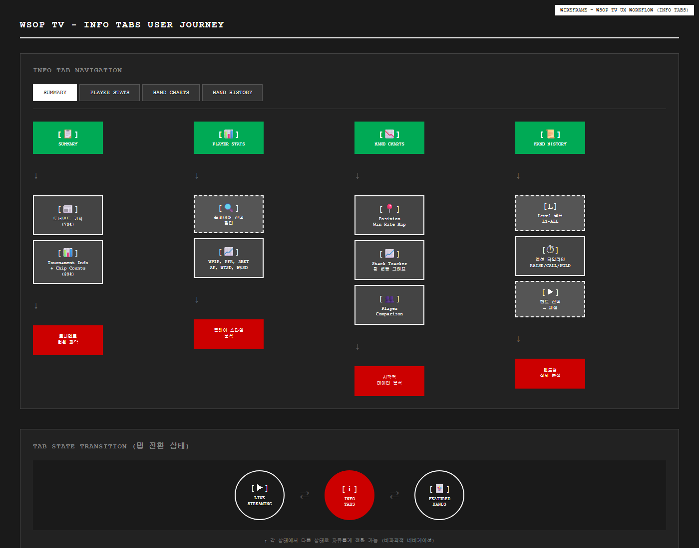

# NBA TV UI 정밀 분석 문서

**Version**: 3.0.0
**Date**: 2026-01-21
**Purpose**: NBA TV 스크린샷을 기반으로 한 정밀 UI/UX 분석
**목업**: B&W HTML 와이어프레임으로 변환됨

---

## 1. 스크린 인벤토리

총 27개의 NBA TV 스크린샷을 13개의 B&W wireframe으로 변환 완료.

| # | 원본 스크린샷 | B&W 목업 | 화면 유형 |
|---|--------------|----------|----------|
| 1 | 113524.png | [`01-main-streaming.html`](../mockups/nbatv/01-main-streaming.html) | 메인 스트리밍 |
| 2 | 113700.png | [`02-streaming-options-broadcasts.html`](../mockups/nbatv/02-streaming-options-broadcasts.html) | 모달 - Broadcasts |
| 3 | 113717.png | [`03-streaming-options-audio.html`](../mockups/nbatv/03-streaming-options-audio.html) | 모달 - Audio |
| 4 | 113734.png | [`04-multiview-selector.html`](../mockups/nbatv/04-multiview-selector.html) | 컴포넌트 - 레이아웃 선택 |
| 5 | 113750.png | [`05-multiview-1x2.html`](../mockups/nbatv/05-multiview-1x2.html) | MultiView 1:2 |
| 6 | 113755.png, 113825.png | [`06-multiview-2x2.html`](../mockups/nbatv/06-multiview-2x2.html) | MultiView 2x2 |
| 7 | 113855-113949.png | [`07-player-controls.html`](../mockups/nbatv/07-player-controls.html) | 플레이어 컨트롤 모음 |
| 8 | 114505.png | [`08-info-summary.html`](../mockups/nbatv/08-info-summary.html) | 정보 - Summary 탭 |
| 9 | 114529.png | [`09-info-boxscore.html`](../mockups/nbatv/09-info-boxscore.html) | 정보 - Box Score 탭 |
| 10 | 114548.png, 114600.png, 114611.png | [`10-info-gamecharts.html`](../mockups/nbatv/10-info-gamecharts.html) | 정보 - Game Charts 탭 |
| 11 | 114928.png | [`11-info-playbyplay.html`](../mockups/nbatv/11-info-playbyplay.html) | 정보 - Play-By-Play 탭 |
| 12 | 115018.png | [`12-modal-keyplays.html`](../mockups/nbatv/12-modal-keyplays.html) | 모달 - Key Plays |
| 13 | 115031.png | [`13-keyplays-player.html`](../mockups/nbatv/13-keyplays-player.html) | Key Plays 재생 화면 |

---

## 2. 레이아웃 구조 분석

### 2.1 메인 스트리밍 화면 (7단 구조)


> **HTML 목업**: [`nbatv/01-main-streaming.html`](../mockups/nbatv/01-main-streaming.html)
>
> **분석 다이어그램**: [`nbatv-analysis/01-main-streaming-analysis.html`](../mockups/nbatv-analysis/01-main-streaming-analysis.html)

### 2.2 높이 분석 (픽셀 단위)

| 컴포넌트 | 높이 | 비율 | 비고 |
|----------|------|------|------|
| Scoreboard Ticker | 105px | 12.0% | 날짜 45px, 카드 145px |
| Ad Banner | 90px | 10.3% | 이미지 150x70px |
| Game Header | 60px | 6.9% | - |
| Video Player | ~480px (16:9) | 55.0% | - |
| Stream Tabs | 55px | 6.3% | pill 버튼, 18px 반경 |
| Timeline | 40px | 4.6% | - |
| Player Controls | 65px | 7.4% | - |
| **Total** | **~870px** | **100%** | - |

### 2.3 색상 스펙

| 요소 | 배경 | 텍스트 | 테두리 |
|------|------|--------|--------|
| Ticker | #FFFFFF | #000000 | 1px #000 |
| Ad Banner | #F5F5F5 | #000000 | 2px #000 |
| Game Header | #333333 | #FFFFFF | - |
| Video Player | #111111 | - | - |
| Stream Tabs | #333333 | #FFFFFF | - |
| Timeline | #333333 | #FFFFFF | - |
| Controls | #000000 | #FFFFFF | 1px #666 |

---

## 3. 컴포넌트 상세 분석

### 3.1 Scoreboard Ticker

**Game Card 구조**:
- Status: 경기 상태 (LIVE/Q1-Q4/HALF/END/PREGAME/FINAL)
- Teams: 로고(20x20) + 팀명 + 점수/전적
- Tags: League Pass, Coupang Play, AWS Rivals Week

### 3.2 Streaming Options 모달


> **HTML 목업**: [`nbatv/02-streaming-options-broadcasts.html`](../mockups/nbatv/02-streaming-options-broadcasts.html)

**Broadcasts 탭** (5개 옵션):
| 옵션 | 설명 |
|------|------|
| Bulls (In-Arena) | Local broadcast with home arena game breaks |
| Clippers (In-Arena) | Local broadcast with home arena game breaks |
| Bulls (Studio Show) | Local broadcast with pre, post, and halftime analysis |
| Clippers (Studio Show) | Local broadcast with pre, post, and halftime analysis |
| Mobile View (In-Arena) | Optimized viewing experience, focused on close up action |

**Audio 탭** (4개 옵션):


> **HTML 목업**: [`nbatv/03-streaming-options-audio.html`](../mockups/nbatv/03-streaming-options-audio.html)

| 옵션 |
|------|
| Bulls Radio |
| Clippers Radio |
| Bulls Radio - Spanish |
| Clippers Radio - Spanish |

### 3.3 MultiView 레이아웃


> **HTML 목업**: [`nbatv/04-multiview-selector.html`](../mockups/nbatv/04-multiview-selector.html)

| 레이아웃 | 그리드 | 용도 |
|----------|--------|------|
| Single [1] | 1x1 | 단일 경기 집중 |
| Split [1:2] | 1+1 (좌우 분할) | 2개 경기 비교 |
| Quad [2x2] | 2x2 | 4개 경기 동시 시청 |

**빈 슬롯 텍스트**: "Add a Game from Score Strip"

### 3.4 Player Controls 상세


> **HTML 목업**: [`nbatv/07-player-controls.html`](../mockups/nbatv/07-player-controls.html)
>
> **분석 다이어그램**: [`nbatv-analysis/12-player-controls-analysis.html`](../mockups/nbatv-analysis/12-player-controls-analysis.html)

**왼쪽 컨트롤**:
| 버튼 | 기능 | 단축키 |
|------|------|--------|
| ⏸ | Play/Pause | Space |
| ⏪ | Rewind | ← |
| 10↺ | 10초 되감기 | - |
| ⏰ | Skip | - |
| ⏩ | Forward | → |
| 🔊 | Volume | M (mute) |

**오른쪽 컨트롤**:
| 버튼 | 기능 | 단축키 |
|------|------|--------|
| CC | Closed Captions | C |
| ⚙ | Settings | - |
| ⊞ | MultiView | Shift+M |
| 🖼 | Picture-in-Picture | P |
| ⛶ | Fullscreen | F |
| →| | Jump to Live | Shift+→ |

### 3.5 Info Tabs (4개 탭)

| 탭 | 내용 | 목업 |
|----|------|------|
| **Summary** | 경기 프리뷰 기사 + Game Info | [`08-info-summary.html`](../mockups/nbatv/08-info-summary.html) |
| **Box Score** | 선수별 상세 통계 테이블 | [`09-info-boxscore.html`](../mockups/nbatv/09-info-boxscore.html) |
| **Game Charts** | Shot Charts + Lead Tracker | [`10-info-gamecharts.html`](../mockups/nbatv/10-info-gamecharts.html) |
| **Play-By-Play** | 쿼터별 타임라인 이벤트 | [`11-info-playbyplay.html`](../mockups/nbatv/11-info-playbyplay.html) |

---

## 4. 워크플로우 분석

### 4.1 사용자 네비게이션 흐름


> **HTML 목업**: [`wsoptv/14-ux-workflow-main.html`](../mockups/wsoptv/14-ux-workflow-main.html)

**메인 화면 진입 후 경로**:
1. **SCOREBOARD TICKER** → 경기 선택 → ADD TO MULTIVIEW
2. **STREAM TABS**
   - Streams → 방송 변경
   - MultiView → 레이아웃 변경
   - Key Plays → 하이라이트 → KEY PLAYS PLAYER
3. **PLAYER CONTROLS** → STREAMING OPTIONS

### 4.2 게임 정보 접근 흐름



> **HTML 목업**: [`wsoptv/15-ux-workflow-info.html`](../mockups/wsoptv/15-ux-workflow-info.html)

| 탭 | 주요 내용 |
|----|----------|
| Summary | Article, Game Info, Line Scores, Lead Changes, Times Tied |
| Box Score | Team A Stats, Team B Stats, DNP List, Totals Row |
| Game Charts | Shot Charts, Lead Tracker, Team Compare, Leading Plyr |
| Play-By-Play | Q1, Q2, Q3, Q4, ALL |

---

## 5. 인터랙션 패턴

### 5.1 Hover 상태
| 요소 | Hover 효과 |
|------|-----------|
| Ticker Game Card | 배경색 #F5F5F5 |
| Control Button | 배경색 #333333 |
| Tab | 배경색 #F5F5F5 |
| Modal Option | 배경색 #F5F5F5 |

### 5.2 Active/Selected 상태
| 요소 | Active 효과 |
|------|------------|
| Tab | border-bottom: 3px solid #000 + font-weight: bold |
| Layout Button | background: #FFF, color: #000 |
| Stream Option | checkbox checked [✓] |

### 5.3 Live 표시
| 위치 | 표시 방식 |
|------|----------|
| Ticker | ● Q3 4:49 (빨간 점 + 시간) |
| Timeline | LIVE (빨간 텍스트) |
| Play-By-Play | [LIVE] 뱃지 (빨간 배경) |

---

## 6. 전체 픽셀 사양 (Pixel Specifications)

### 6.1 원본 스크린샷 해상도

| 스크린샷 | 해상도 | 화면 유형 |
|----------|--------|----------|
| 113524.png | 1262 x 952 | 메인 스트리밍 |
| 113700.png | 488 x 672 | Streaming Options (Broadcasts) |
| 113717.png | 486 x 674 | Streaming Options (Audio) |
| 113734.png | 140 x 96 | MultiView Selector |
| 113750.png | 1260 x 708 | MultiView 1:2 |
| 113825.png | 1260 x 944 | MultiView 2x2 |
| 114505.png | 1238 x 1024 | Info - Summary |
| 114529.png | 1256 x 902 | Info - Box Score |
| 114548.png | 1228 x 1052 | Info - Game Charts |
| 114928.png | 1228 x 972 | Info - Play-By-Play |
| 114955.png | 486 x 666 | Key Plays Modal |

### 6.2 메인 스트리밍 컴포넌트 픽셀 사양

**기준 화면**: 1262 x 952 px (원본 스크린샷)

| 컴포넌트 | 높이 (px) | 폭 (px) | 세부 사양 |
|----------|-----------|---------|----------|
| **Scoreboard Ticker** | 105 | 100% | 날짜 영역 45px, 게임 카드 145px |
| └ 날짜 영역 | 105 | 45 | 텍스트 중앙 정렬 |
| └ 게임 카드 | 105 | 145-160 | 상태 + 팀 정보 + 태그 |
| **Ad Banner** | 90 | 100% | 수평 스크롤 없음 |
| └ 상품 이미지 | 70 | 150 | 좌측 배치 |
| └ CTA 버튼 | 40 | 100 | 빨간 배경 |
| └ 프로모 영역 | 70 | 170 | 우측 배치 (AWS Rivals Week) |
| **Game Header** | 60 | 100% | 팀명 + 방송 정보 |
| **Video Player** | 480 | 100% | aspect-ratio: 16/9 |
| **Stream Tabs** | 55 | 100% | pill 버튼, border-radius 18px |
| └ 탭 버튼 | 36 | 120-140 | 패딩 8px 16px |
| **Timeline** | 40 | 100% | 빨간 진행바 |
| **Player Controls** | 65 | 100% | 좌측 Playback + 우측 Utility |
| └ 컨트롤 버튼 | 40 | 40 | 아이콘 중앙 정렬 |

### 6.3 Streaming Options 모달 픽셀 사양

**기준**: 488 x 672 px

| 요소 | 높이 (px) | 폭 (px) | 세부 |
|------|-----------|---------|------|
| **Modal Container** | 672 | 488 | 흰색 배경, 둥근 모서리 |
| Header | 80 | 100% | 제목 + 닫기 버튼 |
| Tab Navigation | 50 | 100% | Broadcasts / Audio |
| Option Row | 75 | 100% | 아이콘 40x40 + 텍스트 |
| └ Team Icon | 40 | 40 | 원형 또는 사각형 |
| └ Checkbox | 24 | 24 | 우측 체크박스 |

### 6.4 Info Tabs 픽셀 사양

**Summary Tab** (1238 x 1024 px):

| 요소 | 높이 (px) | 폭 | 세부 |
|------|-----------|-----|------|
| Tab Navigation | 50 | 100% | 4개 탭, 밑줄 active |
| Ad Banner | 90 | 100% | 메인과 동일 |
| Article Section | 가변 | 70% | 좌측 메인 콘텐츠 |
| Sidebar | 가변 | 30% | Game Info + Linescores |
| └ Info Row | 50 | 100% | 아이콘 24x24 + 텍스트 |
| └ Line Scores Table | 120 | 100% | 5열 (TEAM, Q1-Q4) |

**Box Score Tab** (1256 x 902 px):

| 요소 | 높이 (px) | 폭 | 세부 |
|------|-----------|-----|------|
| Team Tabs | 45 | 200 | 팀 전환 버튼 |
| Stats Table Header | 35 | 100% | 18개 컬럼 헤더 |
| Stats Table Row | 44 | 100% | 선수 통계 행 |
| Totals Row | 44 | 100% | 볼드, 배경색 차별화 |

### 6.5 Key Plays Modal 픽셀 사양

**기준**: 486 x 666 px

| 요소 | 높이 (px) | 폭 (px) | 세부 |
|------|-----------|---------|------|
| Header | 60 | 100% | 아이콘 + "KEY PLAYS" + 닫기 |
| Play Card | 90 | 100% | 썸네일 + 제목 + 시간 |
| └ Thumbnail | 60 | 100 | 비디오 프레임 |
| └ Title | 20 | 가변 | 볼드 텍스트 |
| └ Time | 16 | 가변 | "Q1 • 00:49.5" 형식 |

### 6.6 공통 간격 및 여백

| 용도 | 크기 (px) | 적용 |
|------|-----------|------|
| 컴포넌트 간 여백 | 0 | 빈틈 없이 연결 |
| 내부 패딩 (소) | 8-12 | 버튼, 태그 |
| 내부 패딩 (중) | 15-20 | 섹션, 카드 |
| 내부 패딩 (대) | 25-30 | 컨테이너 |
| 테두리 두께 (와이어프레임) | 1-2 | 모든 요소 |

---

## 7. 목업 파일 목록

### 7.1 NBA TV B&W Wireframes (13개)

| 파일명 | 크기 | 설명 |
|--------|------|------|
| [`01-main-streaming.html`](../mockups/nbatv/01-main-streaming.html) | 1280x900 | 메인 스트리밍 화면 |
| [`02-streaming-options-broadcasts.html`](../mockups/nbatv/02-streaming-options-broadcasts.html) | 800x700 | Broadcasts 탭 모달 |
| [`03-streaming-options-audio.html`](../mockups/nbatv/03-streaming-options-audio.html) | 800x600 | Audio 탭 모달 |
| [`04-multiview-selector.html`](../mockups/nbatv/04-multiview-selector.html) | 400x200 | 레이아웃 선택기 |
| [`05-multiview-1x2.html`](../mockups/nbatv/05-multiview-1x2.html) | 1280x800 | 1:2 분할 레이아웃 |
| [`06-multiview-2x2.html`](../mockups/nbatv/06-multiview-2x2.html) | 1280x900 | 2x2 분할 레이아웃 |
| [`07-player-controls.html`](../mockups/nbatv/07-player-controls.html) | 1200x900 | 컨트롤 모음 |
| [`08-info-summary.html`](../mockups/nbatv/08-info-summary.html) | 1280x1000 | Summary 탭 |
| [`09-info-boxscore.html`](../mockups/nbatv/09-info-boxscore.html) | 1400x900 | Box Score 탭 |
| [`10-info-gamecharts.html`](../mockups/nbatv/10-info-gamecharts.html) | 1280x1400 | Game Charts 탭 |
| [`11-info-playbyplay.html`](../mockups/nbatv/11-info-playbyplay.html) | 1280x1000 | Play-By-Play 탭 |
| [`12-modal-keyplays.html`](../mockups/nbatv/12-modal-keyplays.html) | 800x750 | Key Plays 모달 |
| [`13-keyplays-player.html`](../mockups/nbatv/13-keyplays-player.html) | 1280x800 | Key Plays 재생 화면 |

### 7.2 분석 다이어그램 (12개)

| 파일명 | 설명 |
|--------|------|
| [`01-main-streaming-analysis.html`](../mockups/nbatv-analysis/01-main-streaming-analysis.html) | 메인 화면 레이어 분석 |
| [`02-streaming-options-broadcasts-analysis.html`](../mockups/nbatv-analysis/02-streaming-options-broadcasts-analysis.html) | Broadcasts 모달 분석 |
| [`03-streaming-options-audio-analysis.html`](../mockups/nbatv-analysis/03-streaming-options-audio-analysis.html) | Audio 모달 분석 |
| [`04-multiview-selector-analysis.html`](../mockups/nbatv-analysis/04-multiview-selector-analysis.html) | 레이아웃 선택기 분석 |
| [`05-multiview-layout-analysis.html`](../mockups/nbatv-analysis/05-multiview-layout-analysis.html) | MultiView 레이아웃 분석 |
| [`06-info-summary-analysis.html`](../mockups/nbatv-analysis/06-info-summary-analysis.html) | Summary 탭 분석 |
| [`07-info-boxscore-analysis.html`](../mockups/nbatv-analysis/07-info-boxscore-analysis.html) | Box Score 탭 분석 |
| [`08-info-gamecharts-analysis.html`](../mockups/nbatv-analysis/08-info-gamecharts-analysis.html) | Game Charts 탭 분석 |
| [`09-info-playbyplay-analysis.html`](../mockups/nbatv-analysis/09-info-playbyplay-analysis.html) | Play-By-Play 탭 분석 |
| [`10-modal-keyplays-analysis.html`](../mockups/nbatv-analysis/10-modal-keyplays-analysis.html) | Key Plays 모달 분석 |
| [`11-keyplays-player-analysis.html`](../mockups/nbatv-analysis/11-keyplays-player-analysis.html) | Key Plays 재생 화면 분석 |
| [`12-player-controls-analysis.html`](../mockups/nbatv-analysis/12-player-controls-analysis.html) | 플레이어 컨트롤 분석 |

### 7.3 스크린샷 경로

```
docs/images/mockups/nbatv/
├── 01-main-streaming.png
├── 02-streaming-options-broadcasts.png
├── 03-streaming-options-audio.png
├── 04-multiview-selector.png
├── 05-multiview-1x2.png
├── 06-multiview-2x2.png
├── 07-player-controls.png
├── 08-info-summary.png
├── 09-info-boxscore.png
├── 10-info-gamecharts.png
├── 11-info-playbyplay.png
├── 12-modal-keyplays.png
└── 13-keyplays-player.png
```

---

## 8. NBA TV → WSOP TV 매핑 가이드

### 8.1 용어 매핑

| NBA TV | WSOP TV | 설명 |
|--------|---------|------|
| Game | Tournament | 이벤트 단위 |
| Quarter | Level | 시간 단위 |
| Team | Player | 참가자 |
| Points | Chips | 점수 단위 |
| Score Strip | Tournament Ticker | 상단 티커 |
| Box Score | Player Stats | 통계 테이블 |
| Shot Charts | Position Map | 시각화 차트 |
| Lead Tracker | Stack Tracker | 추이 그래프 |
| Play-By-Play | Hand History | 타임라인 |
| Key Plays | Featured Hands | 하이라이트 |
| Broadcasts | Camera Views | 영상 소스 |
| Radio | Commentary | 오디오 소스 |

### 8.2 기능 매핑

| NBA TV 기능 | WSOP TV 기능 |
|------------|--------------|
| Live Score Updates | Live Chip Counts |
| Quarter Switching | Level Switching |
| Team Selection | Table Selection |
| Player Highlights | Hand Highlights |
| Shot Location | Position Statistics |
| Game Preview Article | Tournament Preview |
| Officials Info | Tournament Director |
| Venue Info | Casino/Venue Info |

---

## 9. WSOP TV Wireframe 목록

Phase 4에서 구현된 WSOP TV 목업:

| # | 파일명 | 설명 |
|---|--------|------|
| 1 | [`01-main-streaming.html`](../mockups/wsoptv/01-main-streaming.html) | 메인 스트리밍 |
| 2 | [`02-streaming-options-camera.html`](../mockups/wsoptv/02-streaming-options-camera.html) | Camera 탭 모달 |
| 3 | [`03-streaming-options-commentary.html`](../mockups/wsoptv/03-streaming-options-commentary.html) | Commentary 탭 모달 |
| 4 | [`04-multiview-selector.html`](../mockups/wsoptv/04-multiview-selector.html) | MultiView 선택기 |
| 5 | [`05-multiview-2x2.html`](../mockups/wsoptv/05-multiview-2x2.html) | 2x2 레이아웃 |
| 6 | [`06-info-summary.html`](../mockups/wsoptv/06-info-summary.html) | Summary 탭 |
| 7 | [`07-info-playerstats.html`](../mockups/wsoptv/07-info-playerstats.html) | Player Stats 탭 |
| 8 | [`08-info-handcharts.html`](../mockups/wsoptv/08-info-handcharts.html) | Hand Charts 탭 |
| 9 | [`09-info-handhistory.html`](../mockups/wsoptv/09-info-handhistory.html) | Hand History 탭 |
| 10 | [`10-modal-featuredhands.html`](../mockups/wsoptv/10-modal-featuredhands.html) | Featured Hands 모달 |
| 11 | [`11-featuredhands-player.html`](../mockups/wsoptv/11-featuredhands-player.html) | Featured Hands 재생 |
| 12 | [`12-multiview-1x2.html`](../mockups/wsoptv/12-multiview-1x2.html) | 1x2 레이아웃 |
| 13 | [`13-player-controls.html`](../mockups/wsoptv/13-player-controls.html) | 플레이어 컨트롤 |
| 14 | [`14-ux-workflow-main.html`](../mockups/wsoptv/14-ux-workflow-main.html) | UX 워크플로우 - 메인 |
| 15 | [`15-ux-workflow-info.html`](../mockups/wsoptv/15-ux-workflow-info.html) | UX 워크플로우 - Info |
| 16 | [`16-ux-workflow-featured-hands.html`](../mockups/wsoptv/16-ux-workflow-featured-hands.html) | UX 워크플로우 - Featured Hands |

---

*Document generated from NBA TV UI analysis - All ASCII mockups converted to HTML wireframes*
