# NBA TV UI 상세 분석 문서

**분석일**: 2026-01-21
**소스**: NBA TV League Pass 스크린샷 27장
**목업**: B&W HTML 와이어프레임으로 변환됨

---

## 1. 화면 구성 요소 (Screen Components)

### 1.1 메인 스트리밍 화면 (Main Streaming View)

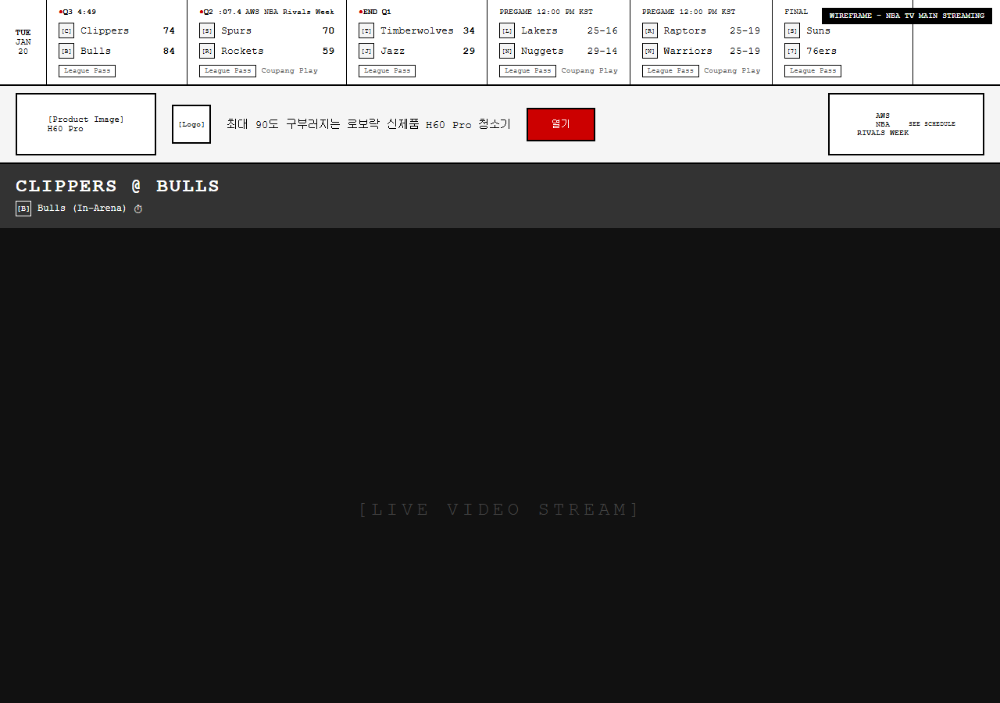

> **HTML 목업**: [`nbatv/01-main-streaming.html`](../mockups/nbatv/01-main-streaming.html)

**7단 레이아웃 구조**:
| # | 컴포넌트 | 높이 | 설명 |
|:--:|----------|------|------|
| 1 | Scoreboard Ticker | 105px | 가로 스크롤 경기 목록 (date: 45px, card: 145px) |
| 2 | Ad Banner | 90px | 광고 배너 (img: 150x70, promo: 170x70) |
| 3 | Game Header | 60px | 경기 제목 (padding: 15px 20px) |
| 4 | Video Player | 16:9 | 메인 영상 (~480px @1280w) |
| 5 | Stream Tabs | 55px | Streams/MultiView/Key Plays (btn: 8px 16px, radius: 18px) |
| 6 | Timeline | 40px | 진행 바 (bar: 4px) |
| 7 | Player Controls | 65px | 재생 컨트롤 (btn: 36x36, large: 44x44) |

---

## 2. 컴포넌트 상세 분석

### [1] SCOREBOARD TICKER

**위치**: 화면 최상단
**높이**: 105px
**배경**: 흰색 (#FFFFFF)

**Date Column 구조**:
- 요일 (TUE) - bold, 10px
- 월 (JAN)
- 일 (20)
- 배경: 연회색 (#F5F5F5)
- 너비: 45px
- padding: 5px

**Game Card 너비**: 145px (min) ~ 160px (max)

**Game Card 구조**:
| 영역 | 내용 |
|------|------|
| Status Row | ● Q3 4:49 + 태그 |
| Team Row 1 | [로고] Team A 74 |
| Team Row 2 | [로고] Team B 84 |
| Provider Tag | ○ League Pass |

**Status 유형**:
| 상태 | 표시 | 설명 |
|------|------|------|
| LIVE | `● Q3 4:49` | 빨간 점 + 쿼터 + 시간 |
| HALF | `HALF` | 하프타임 |
| END Q1 | `● END Q1` | 쿼터 종료 |
| PREGAME | `PREGAME 12:00 PM KST` | 예정 경기 |
| FINAL | `FINAL` | 경기 종료 |

**태그 유형**:
- `[Rivals]` - 라이벌 매치
- `Coupang Play` - 제휴 방송
- (없음) - 기본

---

### [2] AD BANNER

**위치**: Scoreboard Ticker 아래
**높이**: 90px
**구조**: 3열 레이아웃

| 영역 | 크기 | 내용 |
|------|------|------|
| 좌측 | 150x70px | 이미지 광고 (margin: 0 15px) |
| 중앙 | flex | 로고(50x50) + 텍스트 + CTA 버튼 |
| 우측 | 170x70px | 프로모션 카드 (#003087 배경) |

---

### [3] GAME HEADER

**위치**: Ad Banner 아래
**높이**: 약 60px
**배경**: 진회색 (#E0E0E0)

**구성요소**:
- Game Title: "CLIPPERS @ BULLS" (24px, bold, letter-spacing: 2px)
- Sub Info: 팀 로고 + 방송 타입 + 시계 아이콘

---

### [4] VIDEO PLAYER

**위치**: Game Header 아래
**비율**: 16:9
**최대 높이**: 약 500px
**배경**: 검정색 (#000000)

**오버레이 요소**:
- 좌상단: Game Title + 방송 타입
- 우상단: 팀 로고 (워터마크)
- 하단: "Catch up with Key Plays" 버튼 (영상 위에 떠있음)

---

### [5] STREAM TABS

**위치**: Video Player 아래
**높이**: 55px (padding: 12px 20px)
**배경**: 진회색 (#333)

**탭 구성**:
| 탭 | 아이콘 | 라벨 | 배지 |
|----|--------|------|------|
| Streams | 📡 | Streams | 숫자 (9) |
| MultiView | ⊞ | MultiView | - |
| Key Plays | 🔥 | Key Plays | - |

**탭 스타일**:
- 배경: #555 pill 모양 (active: #fff)
- padding: 8px 16px
- font-size: 11px
- border-radius: 18px
- gap: 8px

---

### [6] TIMELINE / PROGRESS BAR

**위치**: Stream Tabs 아래
**높이**: 약 40px
**배경**: 연회색 (#F5F5F5)

**구성요소**:
| 위치 | 내용 |
|------|------|
| 좌측 | 경과 시간 (01:35:55) |
| 중앙 | Progress Bar (빨간색 선) |
| 우측 | LIVE 배지 |

---

### [7] PLAYER CONTROLS

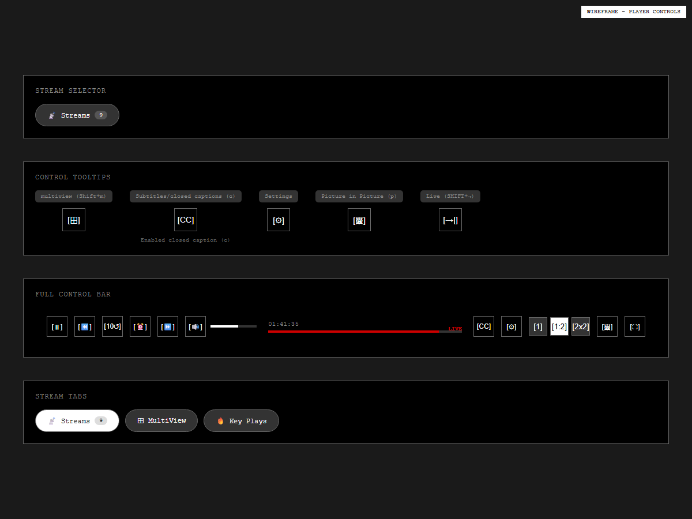

> **HTML 목업**: [`nbatv/07-player-controls.html`](../mockups/nbatv/07-player-controls.html)

**위치**: 화면 최하단
**높이**: 65px (padding: 15px 20px)
**배경**: 진회색 (#333) + 상단 border (#444)

**좌측 컨트롤**:
| 순서 | 아이콘 | 기능 |
|------|--------|------|
| 1 | ⏸ | Play/Pause |
| 2 | ⏪ | Rewind 10초 |
| 3 | 🔄 | 되돌리기 |
| 4 | 📺 | 화면 옵션 |
| 5 | ⏩ | Forward 10초 |
| 6 | 🔊 | Volume |

**우측 컨트롤**:
| 순서 | 아이콘 | 기능 | 단축키 |
|------|--------|------|--------|
| 1 | CC | Closed Caption | C |
| 2 | ⊞ | MultiView | Shift+M |
| 3 | ⚙️ | Settings | - |
| 4 | 🖼️ | Picture-in-Picture | P |
| 5 | ⛶ | Fullscreen | F |

---

## 3. 모달/팝업 화면

### 3.1 STREAMING OPTIONS 모달

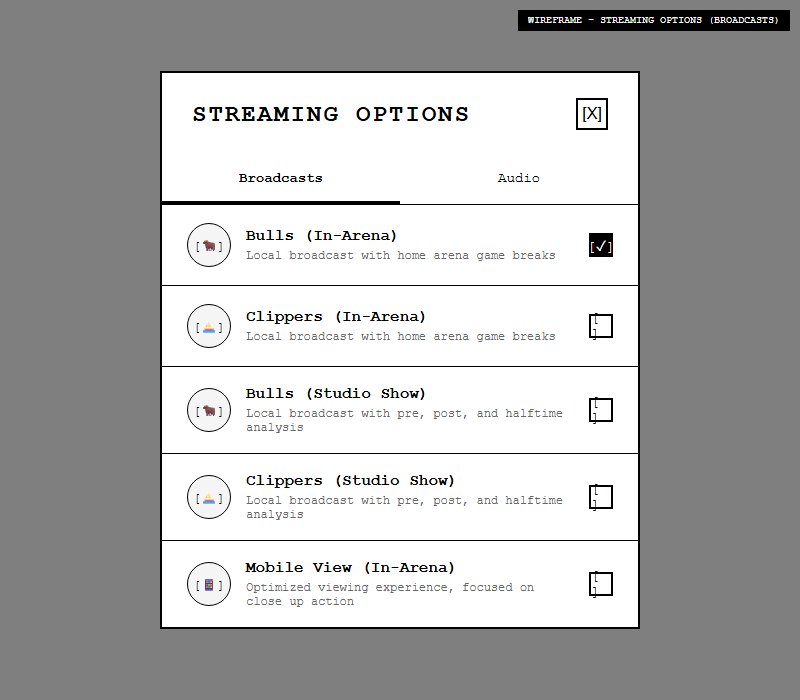

> **HTML 목업**: [`nbatv/02-streaming-options-broadcasts.html`](../mockups/nbatv/02-streaming-options-broadcasts.html)

**트리거**: Streams 버튼 클릭 또는 Video Player 내 설정
**크기**: 약 400x500px
**위치**: 화면 중앙

**탭 구조**:
1. **Broadcasts** (기본)
   - Bulls (In-Arena) - 홈 팀 아레나 방송
   - Clippers (In-Arena) - 원정 팀 아레나 방송
   - Bulls (Studio Show) - 스튜디오 분석
   - Clippers (Studio Show) - 스튜디오 분석
   - Mobile View (In-Arena) - 모바일 최적화

2. **Audio**

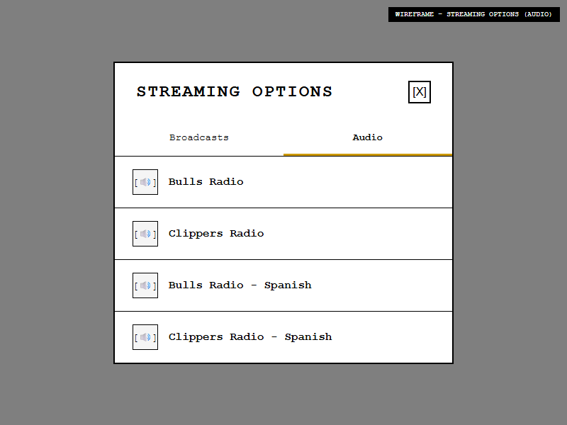

> **HTML 목업**: [`nbatv/03-streaming-options-audio.html`](../mockups/nbatv/03-streaming-options-audio.html)

   - Bulls Radio
   - Clippers Radio
   - Bulls Radio - Spanish
   - Clippers Radio - Spanish

---

### 3.2 KEY PLAYS 모달

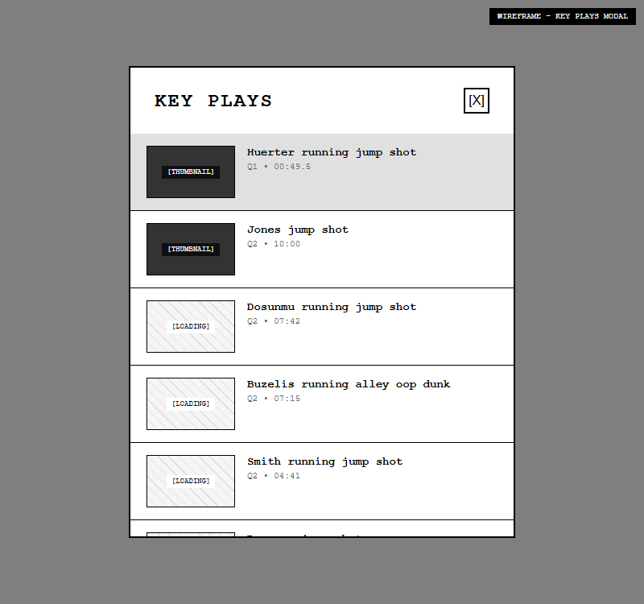

> **HTML 목업**: [`nbatv/12-modal-keyplays.html`](../mockups/nbatv/12-modal-keyplays.html)

**트리거**: Key Plays 탭 클릭
**크기**: 약 400x600px

**Key Play Item 구조**:
| 요소 | 크기/형식 |
|------|----------|
| 썸네일 | 100x60px |
| 제목 | 플레이 설명 |
| 시간 | 쿼터 + 시간 |

---

## 4. MultiView 레이아웃

### 4.1 레이아웃 선택기

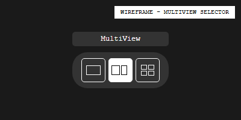

> **HTML 목업**: [`nbatv/04-multiview-selector.html`](../mockups/nbatv/04-multiview-selector.html)

**레이아웃 옵션**:
| 옵션 | 설명 |
|------|------|
| [■] | 1개 (Full) |
| [■\|■] | 2개 (가로 분할) |
| [■■][■■] | 4개 (2x2) |

### 4.2 2분할 레이아웃 (1x2)

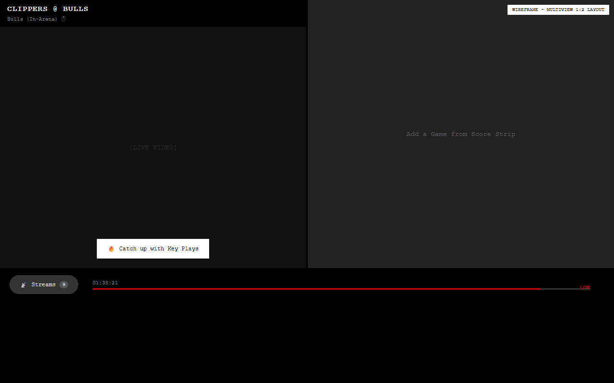

> **HTML 목업**: [`nbatv/05-multiview-1x2.html`](../mockups/nbatv/05-multiview-1x2.html)

### 4.3 4분할 레이아웃 (2x2)

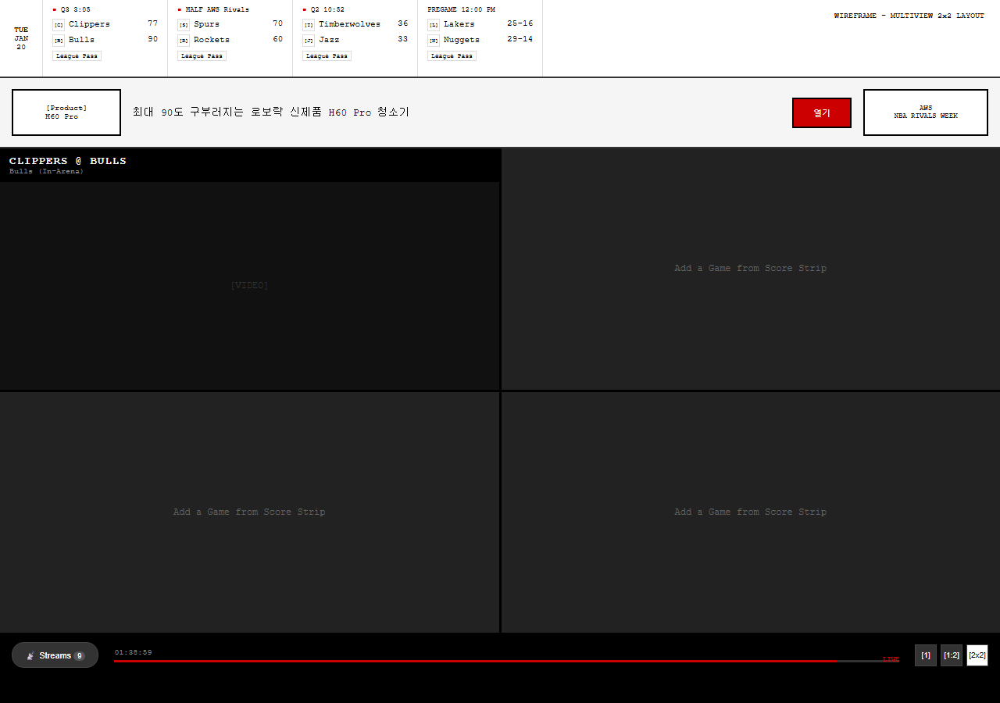

> **HTML 목업**: [`nbatv/06-multiview-2x2.html`](../mockups/nbatv/06-multiview-2x2.html)

---

## 5. 정보 페이지 (탭 네비게이션)

### 5.1 탭 구조

| Summary | Box Score | Game Charts | Play-By-Play |
|---------|-----------|-------------|--------------|

---

### 5.2 Summary 탭

> **HTML 목업**: [`nbatv/08-info-summary.html`](../mockups/nbatv/08-info-summary.html)

**레이아웃**: 2열 (70% / 30%)

| 좌측 (70%) | 우측 (30%) |
|------------|------------|
| Article Content | Game Info |
| - 기사 제목 (24px, bold) | 📅 날짜/시간 |
| - 날짜 + "Game Preview" | 📍 경기장 |
| - 본문 텍스트 | 👤 심판 |
| | 📺 방송 |
| | 🎧 라디오 |
| | Linescores |

---

### 5.3 Box Score 탭

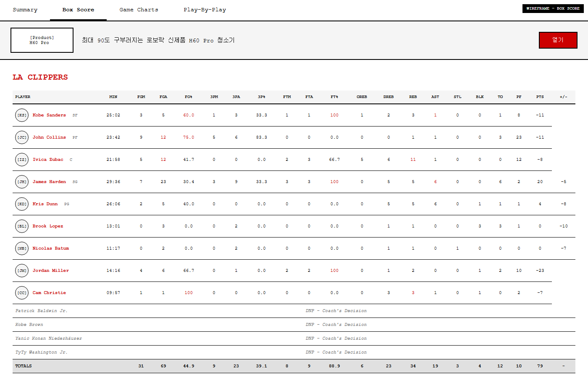

> **HTML 목업**: [`nbatv/09-info-boxscore.html`](../mockups/nbatv/09-info-boxscore.html)

**레이아웃**: 전체 너비 테이블

**컬럼 목록**:
MIN, FGM, FGA, FG%, 3PM, 3PA, 3P%, FTM, FTA, FT%, OREB, DREB, REB, AST, STL, BLK, TO, PF, PTS, +/-

---

### 5.4 Game Charts 탭

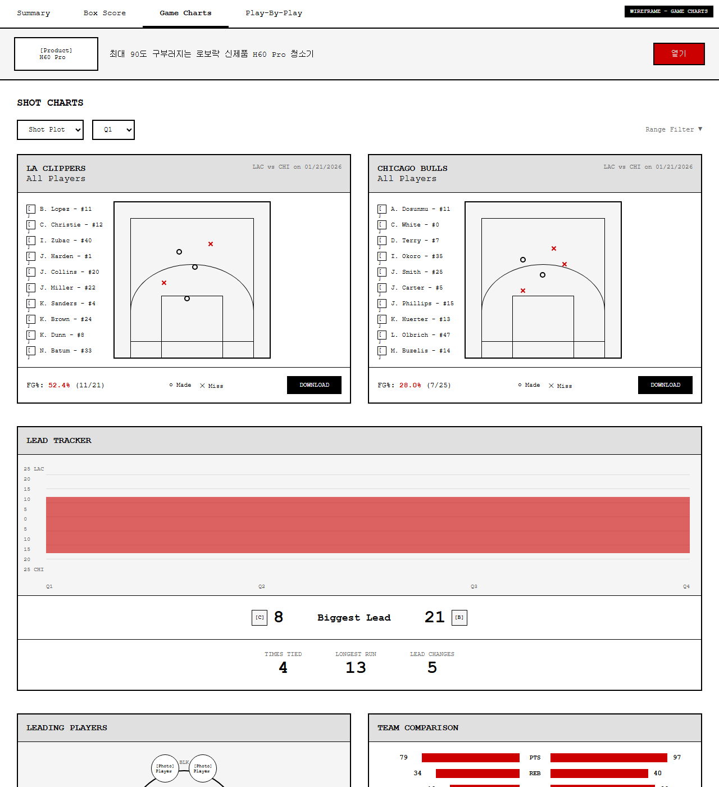

> **HTML 목업**: [`nbatv/10-info-gamecharts.html`](../mockups/nbatv/10-info-gamecharts.html)

**레이아웃**: 2열

| 좌측 | 우측 |
|------|------|
| LA Clippers Shot Chart | Chicago Bulls Shot Chart |
| FG%: 52.4% (11/21) | FG%: 28.0% (7/25) |
| [DOWNLOAD] | [DOWNLOAD] |

**Lead Tracker**: 경기 흐름 시각화
**통계**: TIMES TIED, LONGEST RUN, LEAD CHANGES

---

### 5.5 Play-By-Play 탭

> **HTML 목업**: [`nbatv/11-info-playbyplay.html`](../mockups/nbatv/11-info-playbyplay.html)

**레이아웃**: 타임라인 형식

**필터 옵션**:
- [Q1] [Q2] [Q3] [Q4 ●] [ALL]
- [LIVE] Auto Switch
- Latest First

**이벤트 타입**:
- 득점 (Layup, Jump Shot, 3PT, Dunk 등)
- 리바운드 (OREB, DREB)
- 어시스트 (AST)
- 파울 (FOUL, PF)
- 턴오버 (TURNOVER, TO)
- 스틸 (STEAL, STL)
- 블록 (BLOCK, BLK)
- 교체 (SUB In/Out)

---

## 6. 워크플로우 분석

### 6.1 사용자 시나리오

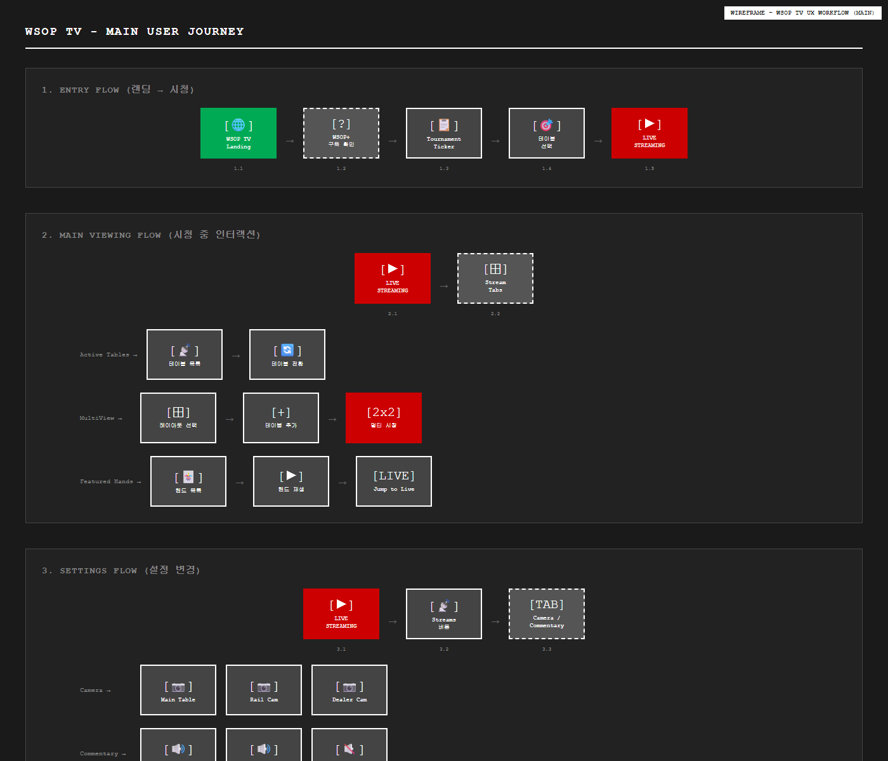

> **HTML 목업**: [`wsoptv/14-ux-workflow-main.html`](../mockups/wsoptv/14-ux-workflow-main.html)

**메인 화면 진입 후 경로**:
1. **Scoreboard Ticker** → 경기 선택 → 스트리밍 시작
2. **Streams 탭** → Streaming Options 모달
   - Broadcasts 탭: 카메라 선택
   - Audio 탭: 오디오 선택
3. **MultiView 탭** → 레이아웃 선택 (1/2/4)
4. **Key Plays 탭** → 하이라이트 목록 → 클릭 시 해당 시점으로 이동
5. **정보 페이지 이동** (스크롤 또는 탭)
   - Summary: 기사 + 경기 정보
   - Box Score: 선수별 통계
   - Game Charts: 시각화 차트
   - Play-By-Play: 이벤트 타임라인

---

## 7. 색상 팔레트

| 용도 | 색상 코드 | 샘플 |
|------|----------|------|
| 배경 (밝은) | #FFFFFF | ████ |
| 배경 (연회색) | #F5F5F5 | ████ |
| 배경 (진회색) | #E0E0E0 | ████ |
| 텍스트 (기본) | #000000 | ████ |
| 텍스트 (보조) | #666666 | ████ |
| 강조 (LIVE) | #FF0000 | ████ |
| 강조 (CTA) | #FF3B30 | ████ |
| 비디오 배경 | #000000 | ████ |

---

## 8. 폰트 스타일

| 용도 | 크기 | 두께 | 폰트 |
|------|------|------|------|
| Game Title | 24px | Bold | Sans-serif |
| Section Title | 18px | Bold | Sans-serif |
| Body Text | 14px | Regular | Sans-serif |
| Small Text | 12px | Regular | Sans-serif |
| Tab Label | 14px | Medium | Sans-serif |
| Stats Number | 14px | Regular | Monospace |

---

## 관련 목업 파일

### NBA TV 목업
| # | 파일 | 화면 유형 |
|---|------|----------|
| 1 | [`01-main-streaming.html`](../mockups/nbatv/01-main-streaming.html) | 메인 스트리밍 |
| 2 | [`02-streaming-options-broadcasts.html`](../mockups/nbatv/02-streaming-options-broadcasts.html) | 모달 - Broadcasts |
| 3 | [`03-streaming-options-audio.html`](../mockups/nbatv/03-streaming-options-audio.html) | 모달 - Audio |
| 4 | [`04-multiview-selector.html`](../mockups/nbatv/04-multiview-selector.html) | MultiView 선택기 |
| 5 | [`05-multiview-1x2.html`](../mockups/nbatv/05-multiview-1x2.html) | MultiView 1:2 |
| 6 | [`06-multiview-2x2.html`](../mockups/nbatv/06-multiview-2x2.html) | MultiView 2x2 |
| 7 | [`07-player-controls.html`](../mockups/nbatv/07-player-controls.html) | 플레이어 컨트롤 |
| 8 | [`08-info-summary.html`](../mockups/nbatv/08-info-summary.html) | 정보 - Summary |
| 9 | [`09-info-boxscore.html`](../mockups/nbatv/09-info-boxscore.html) | 정보 - Box Score |
| 10 | [`10-info-gamecharts.html`](../mockups/nbatv/10-info-gamecharts.html) | 정보 - Game Charts |
| 11 | [`11-info-playbyplay.html`](../mockups/nbatv/11-info-playbyplay.html) | 정보 - Play-By-Play |
| 12 | [`12-modal-keyplays.html`](../mockups/nbatv/12-modal-keyplays.html) | 모달 - Key Plays |
| 13 | [`13-keyplays-player.html`](../mockups/nbatv/13-keyplays-player.html) | Key Plays 재생 화면 |

---

## 다음 단계

이 분석을 기반으로:
1. ✅ NBA TV 목업 디자인 (B&W 와이어프레임 HTML 변환)
2. ✅ WSOP TV 로 변환 설계 완료
