# WSOP TV OTT Solution PRD

**Version**: 4.0.0
**Date**: 2026-01-22
**Reference**: NBA TV League Pass
**Design Principle**: NBA TV 1:1 복제 (용어만 변경)

---

## 0. 설계 원칙

### 0.1 핵심 원칙: NBA TV 1:1 대응

> **"주관적 해석 배제, 최대한 동일한 디자인 레이아웃 설계"**

본 PRD는 NBA TV League Pass의 UI/UX를 **1:1 복제**하여 WSOP TV로 변환합니다.
- **변경**: 용어 (Game→Tournament, Score→Chips 등)
- **유지**: 레이아웃, 구조, 인터랙션, 컴포넌트 배치
- **금지**: NBA TV에 없는 기능의 Core 포함

### 0.2 문서 구조

각 기능별로 다음 **3단계 변환 프로세스**를 시각적으로 제시합니다:

```
┌─────────────────────┐     ┌─────────────────────┐     ┌─────────────────────┐
│ ① NBA TV 스크린샷  │ ──▶ │ ② NBA TV B&W 목업  │ ──▶ │ ③ WSOP TV B&W 목업 │
│   (실제 UI 캡처)    │     │  (와이어프레임 변환) │     │  (용어/도메인 변환)  │
└─────────────────────┘     └─────────────────────┘     └─────────────────────┘
```

### 0.3 기능 분류

| 분류 | 정의 | 예시 |
|------|------|------|
| **Core** | NBA TV에 존재하는 기능의 1:1 대응 | Ticker, MultiView, Key Plays |
| **Extension** | 포커 도메인 특화 확장 기능 | Equity Meter, Hand Range |

### 0.4 전체 용어 매핑

| NBA TV | WSOP TV | 비고 |
|--------|---------|------|
| Scoreboard Ticker | Tournament Ticker | 동일 구조 |
| Q3 3:05 | L38 LIVE | Quarter→Level |
| Clippers 77 / Bulls 90 | Negreanu 1.3M | 점수→칩 리더 플레이어 |
| League Pass | WSOP+ | 동일 |
| CLIPPERS @ BULLS | [♠] MAIN EVENT 2024 | 팀→이벤트 |
| Bulls (In-Arena) | Main Table Cam | 동일 |
| Streams 9 | Active Tables 45 | 동일 구조 |
| Key Plays | Featured Hands | 동일 구조 |
| Summary | Summary | 동일 |
| Box Score | Player Stats | 동일 |
| Game Charts | Hand Charts | 동일 |
| Play-By-Play | Hand History | 동일 |

---

## 1. 메인 스트리밍 UI `[Core]`

### 1.1 변환 프로세스

#### ① NBA TV 실제 스크린샷


#### ② NBA TV B&W 목업


> **목업 파일**: [`nbatv/01-main-streaming.html`](../mockups/nbatv/01-main-streaming.html)

#### ③ WSOP TV B&W 목업
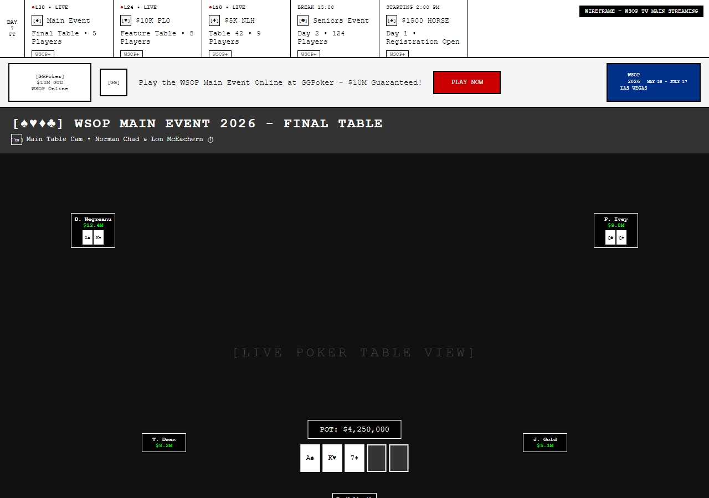

> **목업 파일**: [`wsoptv/01-main-streaming.html`](../mockups/wsoptv/01-main-streaming.html)

### 1.2 용어 변환

| 레이어 | NBA TV | WSOP TV |
|:------:|--------|---------|
| ① | Scoreboard Ticker | Tournament Ticker |
| ② | Ad Banner | Ad Banner (동일) |
| ③ | CLIPPERS @ BULLS | [♠] MAIN EVENT 2024 |
| ④ | Video Player | Video Player (동일) |
| ⑤ | Streams 9 / MultiView / Key Plays | Active Tables 45 / MultiView / Featured Hands |
| ⑥ | Q3 3:05 Timeline | L38 Timeline |
| ⑦ | Controls | Controls (동일) |

### 1.3 7단 레이아웃 구조

| 레이어 | NBA TV 컴포넌트 | WSOP TV 컴포넌트 |
|:------:|-----------------|------------------|
| ① | Scoreboard Ticker | Tournament Ticker |
| ② | Ad Banner | Ad Banner |
| ③ | Game Header | Tournament Header |
| ④ | Video Player | Video Player + POT/BOARD 오버레이 |
| ⑤ | Stream Tabs | Stream Tabs |
| ⑥ | Timeline | Timeline |
| ⑦ | Controls | Controls |

---

## 2. Streaming Options - Broadcasts/Camera `[Core]`

### 2.1 변환 프로세스

#### ① NBA TV 실제 스크린샷


#### ② NBA TV B&W 목업


> **목업 파일**: [`nbatv/02-streaming-options-broadcasts.html`](../mockups/nbatv/02-streaming-options-broadcasts.html)

#### ③ WSOP TV B&W 목업
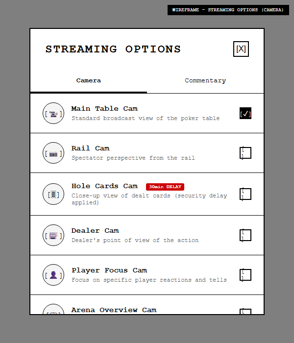

> **목업 파일**: [`wsoptv/02-streaming-options-camera.html`](../mockups/wsoptv/02-streaming-options-camera.html)

### 2.2 용어 변환

| NBA TV (Broadcasts) | WSOP TV (Camera) |
|---------------------|------------------|
| Bulls (In-Arena) | Main Table Cam |
| Clippers (In-Arena) | Rail Cam |
| Bulls (Studio Show) | Dealer Cam |
| Clippers (Studio Show) | Player Focus Cam |
| Mobile View | Arena Overview Cam |

---

## 3. Streaming Options - Audio/Commentary `[Core]`

### 3.1 변환 프로세스

#### ① NBA TV 실제 스크린샷


#### ② NBA TV B&W 목업


> **목업 파일**: [`nbatv/03-streaming-options-audio.html`](../mockups/nbatv/03-streaming-options-audio.html)

#### ③ WSOP TV B&W 목업
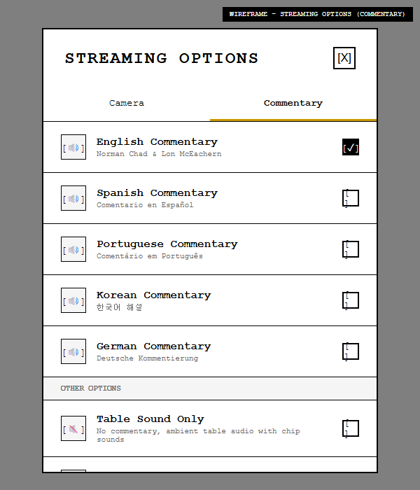

> **목업 파일**: [`wsoptv/03-streaming-options-commentary.html`](../mockups/wsoptv/03-streaming-options-commentary.html)

### 3.2 용어 변환

| NBA TV (Audio) | WSOP TV (Commentary) |
|----------------|----------------------|
| Bulls Radio | English Commentary |
| Clippers Radio | Spanish Commentary |
| Spanish | Portuguese/Korean |

---

## 4. MultiView Selector `[Core]`

### 4.1 변환 프로세스

#### ① NBA TV 실제 스크린샷


#### ② NBA TV B&W 목업


> **목업 파일**: [`nbatv/04-multiview-selector.html`](../mockups/nbatv/04-multiview-selector.html)

#### ③ WSOP TV B&W 목업
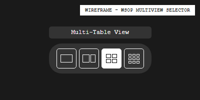

> **목업 파일**: [`wsoptv/04-multiview-selector.html`](../mockups/wsoptv/04-multiview-selector.html)

### 4.2 레이아웃 옵션

| 레이아웃 | NBA TV | WSOP TV |
|----------|--------|---------|
| 1x1 | ✅ 동일 | ✅ 동일 |
| 1:2 | ✅ 동일 | ✅ 동일 |
| 2x2 | ✅ 동일 | ✅ 동일 |
| 3x3 | ❌ 없음 | ✅ Extension (파이널 데이용) |

---

## 5. MultiView 1:2 `[Core]`

### 5.1 변환 프로세스

#### ① NBA TV 실제 스크린샷


#### ② NBA TV B&W 목업


> **목업 파일**: [`nbatv/05-multiview-1x2.html`](../mockups/nbatv/05-multiview-1x2.html)

#### ③ WSOP TV B&W 목업
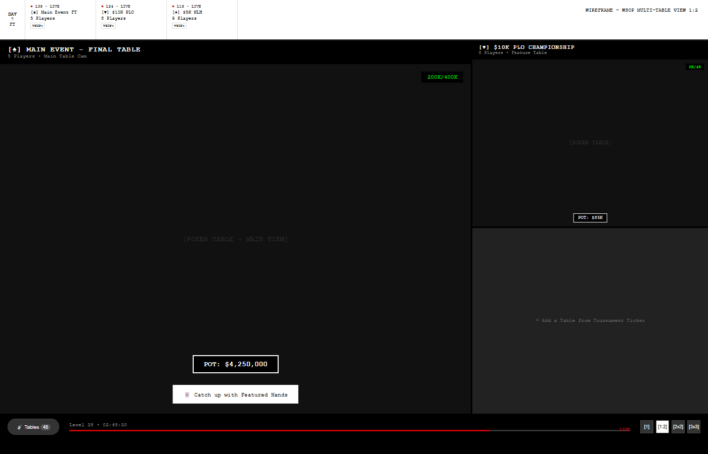

> **목업 파일**: [`wsoptv/12-multiview-1x2.html`](../mockups/wsoptv/12-multiview-1x2.html)

### 5.2 용어 변환

| 요소 | NBA TV | WSOP TV |
|------|--------|---------|
| 메인 영역 | 현재 시청 경기 | 메인 테이블 |
| 사이드 영역 | 빈 슬롯/추가 경기 | 추가 테이블 |
| 버튼 | "Catch up with Key Plays" | "Catch up with Featured Hands" |

---

## 6. MultiView 2x2 `[Core]`

### 6.1 변환 프로세스

#### ① NBA TV 실제 스크린샷


#### ② NBA TV B&W 목업


> **목업 파일**: [`nbatv/06-multiview-2x2.html`](../mockups/nbatv/06-multiview-2x2.html)

#### ③ WSOP TV B&W 목업
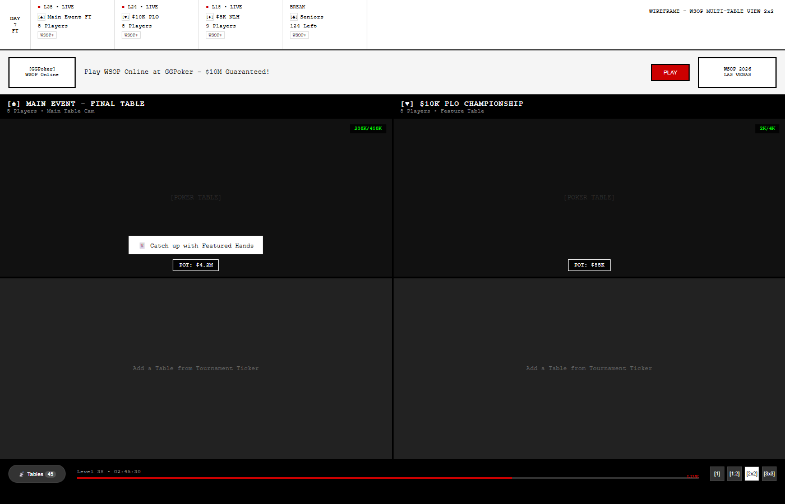

> **목업 파일**: [`wsoptv/05-multiview-2x2.html`](../mockups/wsoptv/05-multiview-2x2.html)

### 6.2 용어 변환

| 요소 | NBA TV | WSOP TV |
|------|--------|---------|
| 빈 슬롯 | "Add a Game from Score Strip" | "Add a Table from Tournament Ticker" |
| 버튼 | "Catch up with Key Plays" | "Catch up with Featured Hands" |

---

## 7. Player Controls `[Core]`

### 7.1 변환 프로세스

#### ① NBA TV 실제 스크린샷 (툴팁 모음)


#### ② NBA TV B&W 목업


> **목업 파일**: [`nbatv/07-player-controls.html`](../mockups/nbatv/07-player-controls.html)

#### ③ WSOP TV B&W 목업
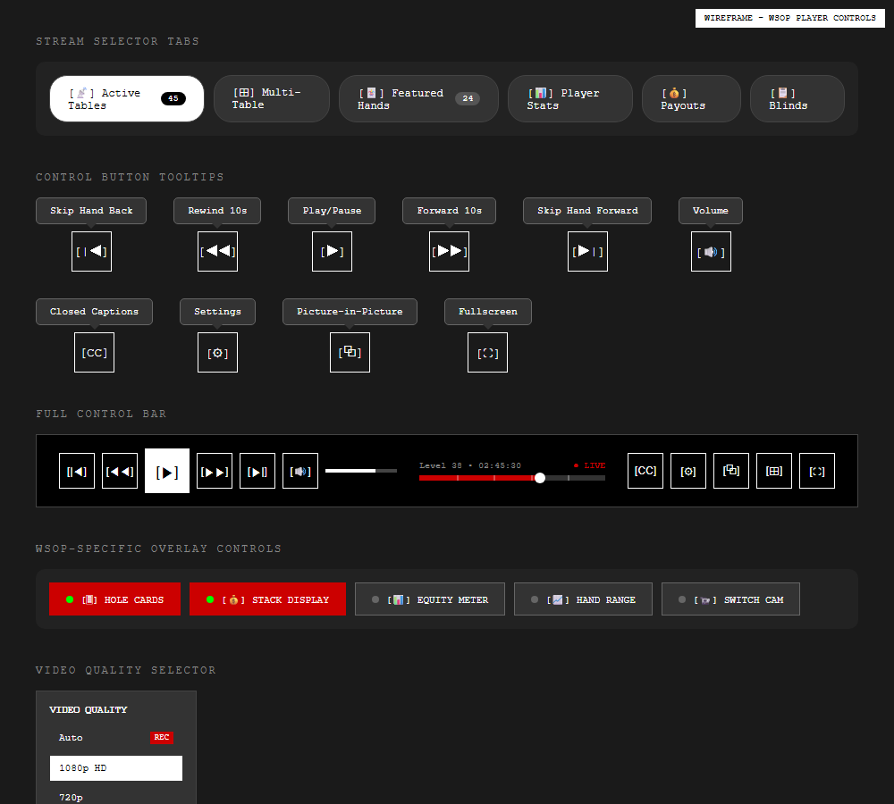

> **목업 파일**: [`wsoptv/13-player-controls.html`](../mockups/wsoptv/13-player-controls.html)

### 7.2 Core 컨트롤 (NBA TV 동일)

| 컨트롤 | 툴팁 | 단축키 |
|--------|------|--------|
| Play/Pause | Play/Pause | Space |
| Rewind | Rewind 10s | ← |
| Forward | Forward 10s | → |
| Volume | Volume | - |
| CC | Subtitles/closed captions | c |
| MultiView | multiview | Shift+m |
| PIP | Picture in Picture | p |
| Fullscreen | Fullscreen | f |
| Live | Live | Shift+→ |

### 7.3 Extension 컨트롤 (포커 전용)

| 컨트롤 | 기능 | 비고 |
|--------|------|------|
| [CARDS] | 홀카드 표시 토글 | NBA TV 없음 |
| [STACK] | 스택 오버레이 토글 | NBA TV 없음 |
| [EQUITY] | 에퀴티 미터 토글 | NBA TV 없음 |
| [CAM] | 카메라 전환 | Settings 확장 |

---

## 8. Info - Summary `[Core]`

### 8.1 변환 프로세스

#### ① NBA TV 실제 스크린샷


#### ② NBA TV B&W 목업


> **목업 파일**: [`nbatv/08-info-summary.html`](../mockups/nbatv/08-info-summary.html)

#### ③ WSOP TV B&W 목업
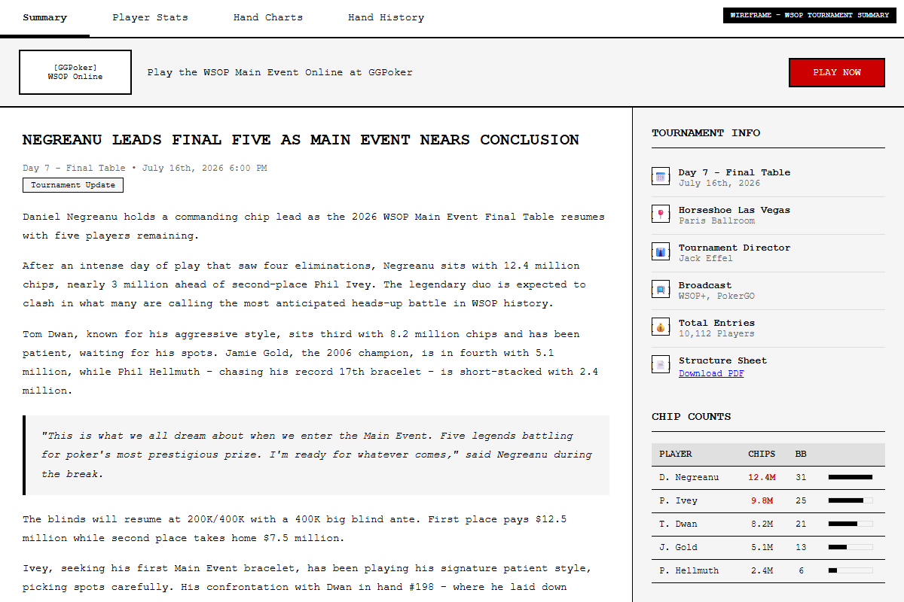

> **목업 파일**: [`wsoptv/06-info-summary.html`](../mockups/wsoptv/06-info-summary.html)

### 8.2 용어 변환

| 영역 | NBA TV | WSOP TV |
|------|--------|---------|
| 좌측 70% | 기사 본문 | 토너먼트 기사 |
| 우측 30% | Game Info + Line Scores | Tournament Info + Chip Counts |

---

## 9. Info - Box Score / Player Stats `[Core]`

### 9.1 변환 프로세스

#### ① NBA TV 실제 스크린샷


#### ② NBA TV B&W 목업


> **목업 파일**: [`nbatv/09-info-boxscore.html`](../mockups/nbatv/09-info-boxscore.html)

#### ③ WSOP TV B&W 목업
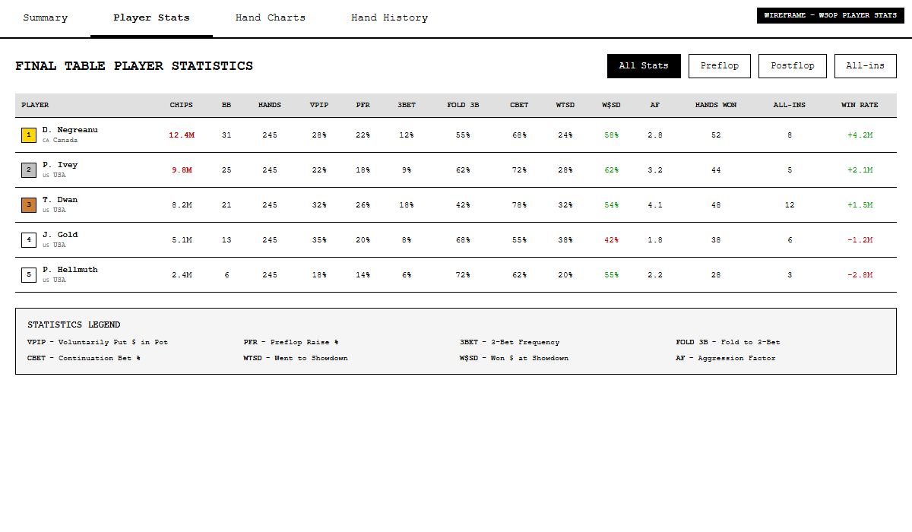

> **목업 파일**: [`wsoptv/07-info-playerstats.html`](../mockups/wsoptv/07-info-playerstats.html)

### 9.2 컬럼 매핑

| NBA TV | WSOP TV | 설명 |
|--------|---------|------|
| MIN | HANDS | 플레이 시간/핸드 |
| FGM | WINS | 성공 횟수 |
| FG% | WIN% | 성공률 |
| 3PM | VPIP | 3점슛/팟 참여 |
| 3PA | PFR | 3점슛 시도/프리플랍 레이즈 |
| REB | CHIPS | 리바운드/칩 |
| +/- | +/- | 동일 |

---

## 10. Info - Game Charts / Hand Charts `[Core]`

### 10.1 변환 프로세스

#### ① NBA TV 실제 스크린샷
**Shot Charts:**


**Lead Tracker:**


**Leading Players:**


#### ② NBA TV B&W 목업


> **목업 파일**: [`nbatv/10-info-gamecharts.html`](../mockups/nbatv/10-info-gamecharts.html)

#### ③ WSOP TV B&W 목업
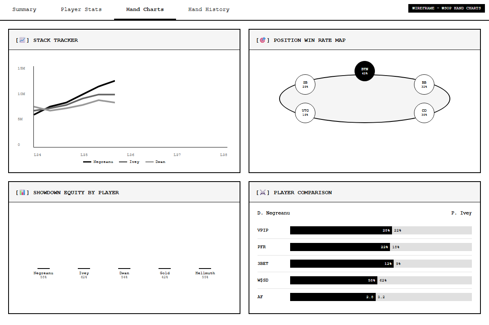

> **목업 파일**: [`wsoptv/08-info-handcharts.html`](../mockups/wsoptv/08-info-handcharts.html)

### 10.2 차트 매핑

| NBA TV | WSOP TV |
|--------|---------|
| Shot Chart | Position Win Rate Map |
| Lead Tracker | Stack Tracker |
| Leading Players (방사형 차트) | Player Stats (VPIP, PFR, 3BET, AF) |
| Team Comparison | Player Comparison |

---

## 11. Info - Play-By-Play / Hand History `[Core]`

### 11.1 변환 프로세스

#### ① NBA TV 실제 스크린샷


#### ② NBA TV B&W 목업


> **목업 파일**: [`nbatv/11-info-playbyplay.html`](../mockups/nbatv/11-info-playbyplay.html)

#### ③ WSOP TV B&W 목업
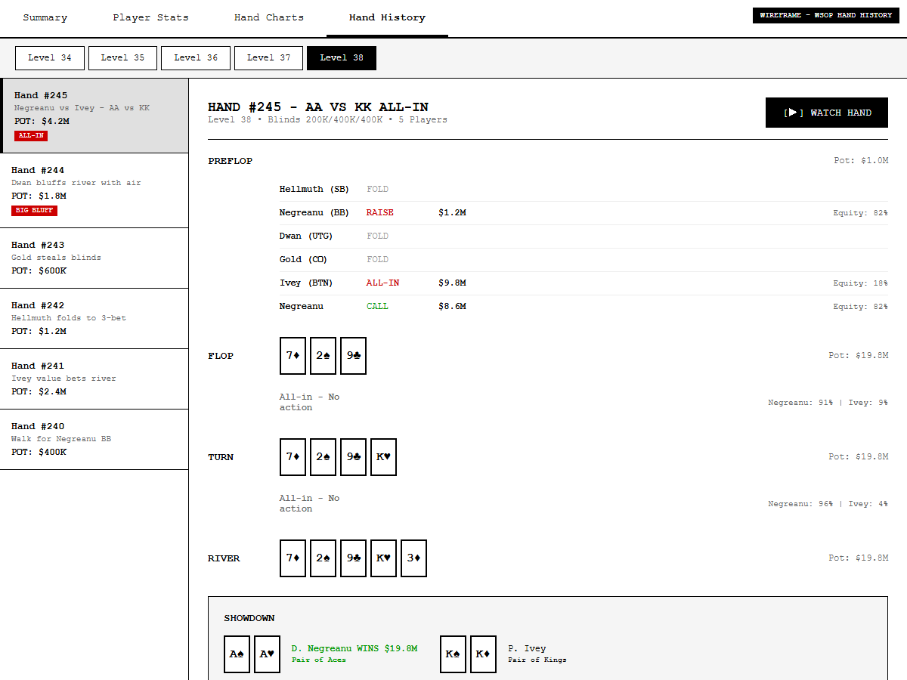

> **목업 파일**: [`wsoptv/09-info-handhistory.html`](../mockups/wsoptv/09-info-handhistory.html)

### 11.2 용어 변환

| 요소 | NBA TV | WSOP TV |
|------|--------|---------|
| 필터 탭 | Q1, Q2, Q3, Q4, ALL | Level 1, 2, 3... ALL |
| 이벤트 타입 | FOUL, STEAL, 득점 등 | RAISE, CALL, FOLD, ALL-IN |
| 점수 | Score | Pot Size, Stack 변화 |

---

## 12. Key Plays / Featured Hands - 모달 `[Core]`

### 12.1 변환 프로세스

#### ① NBA TV 실제 스크린샷


#### ② NBA TV B&W 목업


> **목업 파일**: [`nbatv/12-modal-keyplays.html`](../mockups/nbatv/12-modal-keyplays.html)

#### ③ WSOP TV B&W 목업
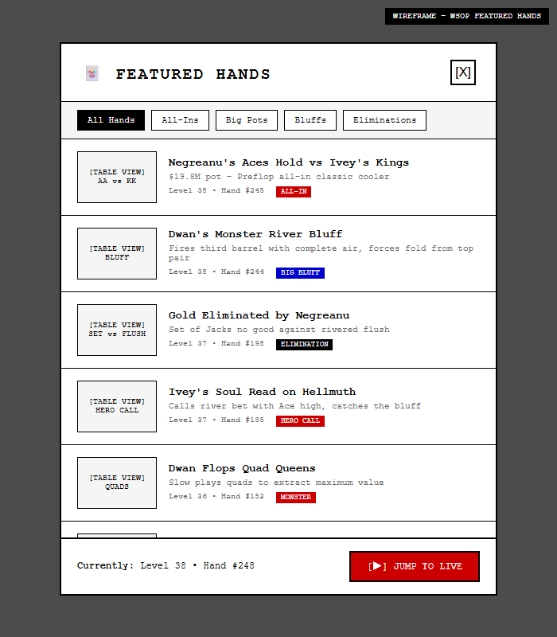

> **목업 파일**: [`wsoptv/10-modal-featuredhands.html`](../mockups/wsoptv/10-modal-featuredhands.html)

### 12.2 용어 변환

| 요소 | NBA TV | WSOP TV |
|------|--------|---------|
| 제목 | Key Plays | Featured Hands |
| 시간 표시 | "Q1 • 00:49.5" | "Level 38 • Hand #245" |
| 필터 | - | All-In, Big Pots, Bluffs, Eliminations |

---

## 13. Key Plays / Featured Hands - 플레이어 `[Core]`

### 13.1 변환 프로세스

#### ① NBA TV 실제 스크린샷


#### ② NBA TV B&W 목업
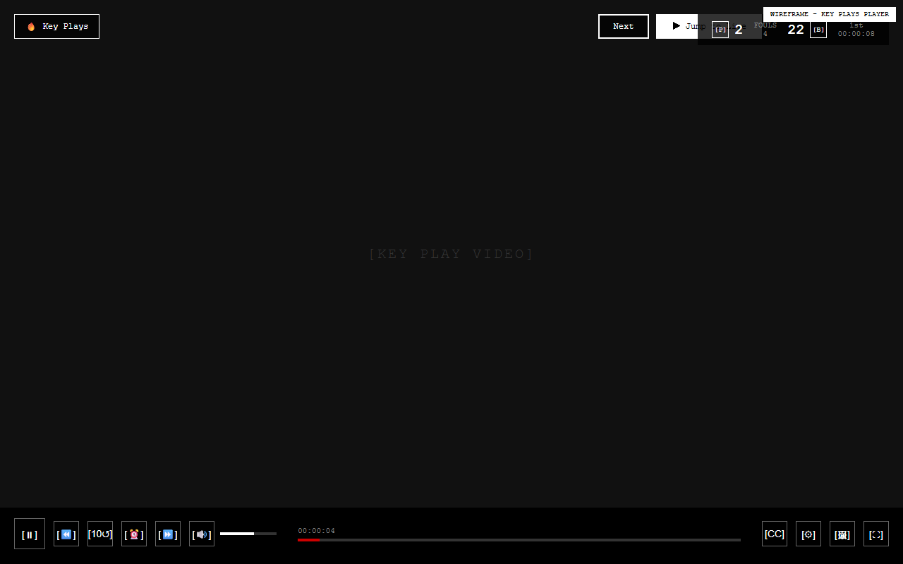

> **목업 파일**: [`nbatv/13-keyplays-player.html`](../mockups/nbatv/13-keyplays-player.html)

#### ③ WSOP TV B&W 목업
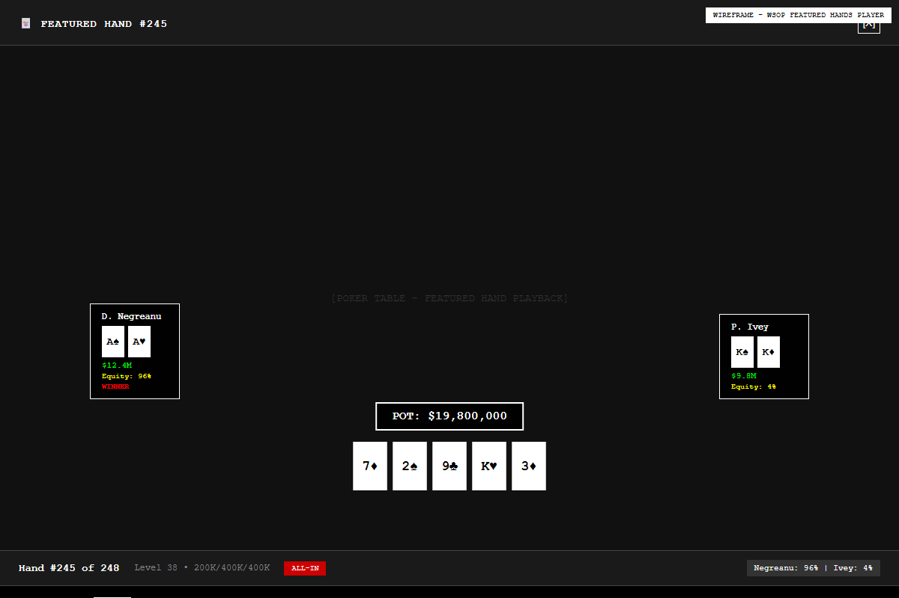

> **목업 파일**: [`wsoptv/11-featuredhands-player.html`](../mockups/wsoptv/11-featuredhands-player.html)

### 13.2 용어 변환

| 요소 | NBA TV | WSOP TV |
|------|--------|---------|
| 타임라인 마커 | Quarter 기반 | Street 기반 (Preflop/Flop/Turn/River/Showdown) |
| 네비게이션 | Prev / Next / Jump to Live | ✅ 동일 |

---

## 14. 확장 기능 (Extension)

> **주의**: 이 섹션의 기능들은 NBA TV에 없는 **포커 도메인 특화 기능**입니다.
> Core 기능 구현 완료 후 Phase 2 이상에서 추가합니다.

### 14.1 Hole Cards Display `[Extension]`
- **30분 딜레이**: 보안을 위해 홀카드는 30분 지연 표시
- **토글**: [CARDS] 버튼으로 ON/OFF
- **RFID 연동**: 테이블 RFID 리더 데이터 실시간 수신

### 14.2 POT/BOARD 오버레이 `[Extension]`
| 요소 | 표시 형식 |
|------|----------|
| POT | `[POT: $2,450,000]` |
| Side Pots | `[MAIN: $1M] [SIDE: $500K]` |
| BOARD | `[BOARD: A♠ K♥ 7♦ __ __]` |
| Action | `[RAISE $150,000]` |

### 14.3 Equity Calculator `[Extension]`
| 요소 | 표시 형식 |
|------|----------|
| Player 1 | `Daniel Negreanu [A♠K♥]: 78.5%` |
| Player 2 | `Phil Ivey [Q♣Q♦]: 21.5%` |
| OUTS | `Q (2장) = 4.5%` |

### 14.4 Hand Range Display `[Extension]`
- 플레이어의 예상 핸드 범위 시각화
- 프리플랍/포스트플랍 레인지 표시

### 14.5 3x3 MultiView `[Extension]`
- 9개 테이블 동시 시청 (파이널 데이용)
- NBA TV의 2x2 확장

---

## 15. 기술 요구사항

### 15.1 스트리밍 프로토콜
| 항목 | 스펙 |
|------|------|
| 프로토콜 | HLS, DASH |
| 화질 | 1080p (기본), 4K (프리미엄) |
| 비트레이트 | 3-15 Mbps 어댑티브 |
| 지연 | 30초 (라이브), 30분 (홀카드) |

### 15.2 다국어 지원
| 언어 | 해설 | UI |
|------|------|-----|
| English | ✅ | ✅ |
| Spanish | ✅ | ✅ |
| Portuguese | ✅ | ✅ |
| Korean | ✅ | ✅ |
| Japanese | ✅ | ✅ |
| Chinese | ✅ | ✅ |

---

## 16. 구현 우선순위

### Phase 1: Core MVP (NBA TV 1:1)
| 기능 | NBA TV 대응 | 상태 |
|------|-------------|------|
| 라이브 스트리밍 플레이어 | Video Player | [ ] |
| Tournament Ticker | Scoreboard Ticker | [ ] |
| 기본 컨트롤 바 | Player Controls | [ ] |
| Stream Tabs | Stream Tabs | [ ] |
| Timeline | Timeline | [ ] |

### Phase 2: Core 확장 (NBA TV 1:1)
| 기능 | NBA TV 대응 | 상태 |
|------|-------------|------|
| MultiView (1x1, 1:2, 2x2) | MultiView | [ ] |
| Featured Hands 모달 | Key Plays 모달 | [ ] |
| Featured Hands 플레이어 | Key Plays 플레이어 | [ ] |
| Streaming Options | Streaming Options | [ ] |

### Phase 3: Core 완성 (NBA TV 1:1)
| 기능 | NBA TV 대응 | 상태 |
|------|-------------|------|
| Info - Summary | Summary | [ ] |
| Info - Player Stats | Box Score | [ ] |
| Info - Hand Charts | Game Charts | [ ] |
| Info - Hand History | Play-By-Play | [ ] |

### Phase 4: Extension (포커 특화)
| 기능 | 상태 |
|------|------|
| Hole Cards Display (30분 딜레이) | [ ] |
| POT/BOARD 오버레이 | [ ] |
| 3x3 MultiView | [ ] |
| Equity Calculator | [ ] |
| Hand Range Display | [ ] |

---

## 부록 A: 와이어프레임 인덱스

### A.1 NBA TV B&W 목업 (13개)

| # | 화면 | HTML | PNG |
|---|------|------|-----|
| 01 | 메인 스트리밍 | [HTML](../mockups/nbatv/01-main-streaming.html) | [PNG](../images/mockups/nbatv/01-main-streaming.png) |
| 02 | Broadcasts 옵션 | [HTML](../mockups/nbatv/02-streaming-options-broadcasts.html) | [PNG](../images/mockups/nbatv/02-streaming-options-broadcasts.png) |
| 03 | Audio 옵션 | [HTML](../mockups/nbatv/03-streaming-options-audio.html) | [PNG](../images/mockups/nbatv/03-streaming-options-audio.png) |
| 04 | MultiView 선택 | [HTML](../mockups/nbatv/04-multiview-selector.html) | [PNG](../images/mockups/nbatv/04-multiview-selector.png) |
| 05 | MultiView 1:2 | [HTML](../mockups/nbatv/05-multiview-1x2.html) | [PNG](../images/mockups/nbatv/05-multiview-1x2.png) |
| 06 | MultiView 2x2 | [HTML](../mockups/nbatv/06-multiview-2x2.html) | [PNG](../images/mockups/nbatv/06-multiview-2x2.png) |
| 07 | 컨트롤 바 | [HTML](../mockups/nbatv/07-player-controls.html) | [PNG](../images/mockups/nbatv/07-player-controls.png) |
| 08 | Summary | [HTML](../mockups/nbatv/08-info-summary.html) | [PNG](../images/mockups/nbatv/08-info-summary.png) |
| 09 | Box Score | [HTML](../mockups/nbatv/09-info-boxscore.html) | [PNG](../images/mockups/nbatv/09-info-boxscore.png) |
| 10 | Game Charts | [HTML](../mockups/nbatv/10-info-gamecharts.html) | [PNG](../images/mockups/nbatv/10-info-gamecharts.png) |
| 11 | Play-By-Play | [HTML](../mockups/nbatv/11-info-playbyplay.html) | [PNG](../images/mockups/nbatv/11-info-playbyplay.png) |
| 12 | Key Plays 목록 | [HTML](../mockups/nbatv/12-modal-keyplays.html) | [PNG](../images/mockups/nbatv/12-modal-keyplays.png) |
| 13 | Key Plays 플레이어 | [HTML](../mockups/nbatv/13-keyplays-player.html) | [PNG](../images/mockups/nbatv/13-keyplays-player.png) |

### A.2 WSOP TV B&W 목업 (13개)

| # | 화면 | HTML | PNG | NBA TV 대응 |
|---|------|------|-----|------------|
| 01 | 메인 스트리밍 | [HTML](../mockups/wsoptv/01-main-streaming.html) | [PNG](../images/mockups/wsoptv/01-main-streaming.png) | Main Streaming |
| 02 | Camera 선택 | [HTML](../mockups/wsoptv/02-streaming-options-camera.html) | [PNG](../images/mockups/wsoptv/02-streaming-options-camera.png) | Broadcasts |
| 03 | Commentary 선택 | [HTML](../mockups/wsoptv/03-streaming-options-commentary.html) | [PNG](../images/mockups/wsoptv/03-streaming-options-commentary.png) | Audio |
| 04 | MultiView 선택 | [HTML](../mockups/wsoptv/04-multiview-selector.html) | [PNG](../images/mockups/wsoptv/04-multiview-selector.png) | MultiView Selector |
| 05 | MultiView 2x2 | [HTML](../mockups/wsoptv/05-multiview-2x2.html) | [PNG](../images/mockups/wsoptv/05-multiview-2x2.png) | MultiView 2x2 |
| 06 | Summary | [HTML](../mockups/wsoptv/06-info-summary.html) | [PNG](../images/mockups/wsoptv/06-info-summary.png) | Summary |
| 07 | Player Stats | [HTML](../mockups/wsoptv/07-info-playerstats.html) | [PNG](../images/mockups/wsoptv/07-info-playerstats.png) | Box Score |
| 08 | Hand Charts | [HTML](../mockups/wsoptv/08-info-handcharts.html) | [PNG](../images/mockups/wsoptv/08-info-handcharts.png) | Game Charts |
| 09 | Hand History | [HTML](../mockups/wsoptv/09-info-handhistory.html) | [PNG](../images/mockups/wsoptv/09-info-handhistory.png) | Play-By-Play |
| 10 | Featured Hands 목록 | [HTML](../mockups/wsoptv/10-modal-featuredhands.html) | [PNG](../images/mockups/wsoptv/10-modal-featuredhands.png) | Key Plays |
| 11 | Featured Hands 플레이어 | [HTML](../mockups/wsoptv/11-featuredhands-player.html) | [PNG](../images/mockups/wsoptv/11-featuredhands-player.png) | Key Plays Player |
| 12 | MultiView 1:2 | [HTML](../mockups/wsoptv/12-multiview-1x2.html) | [PNG](../images/mockups/wsoptv/12-multiview-1x2.png) | MultiView 1:2 |
| 13 | 컨트롤 바 | [HTML](../mockups/wsoptv/13-player-controls.html) | [PNG](../images/mockups/wsoptv/13-player-controls.png) | Player Controls |

---

## 부록 B: 정밀 분석 문서

- **NBA TV 스크린샷 분석**: [`NBATV-SCREENSHOT-ANALYSIS.md`](./NBATV-SCREENSHOT-ANALYSIS.md) - 26개 스크린샷 상세 분석
